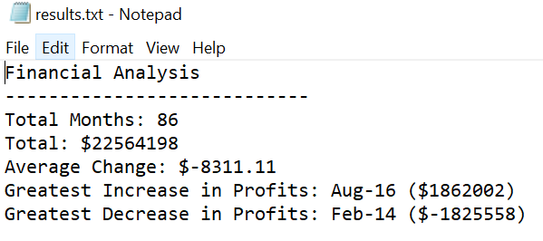
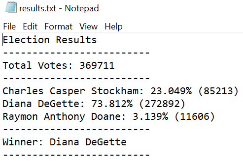

# Module 3 Challenge : PyBank and PyPoll

## Background

The repository for this project is called python-challenge. Inside this repository, there is a folder for each Python assignment namely PyBank and PyPoll.

Each folder contains:

1. A file called main.py with the main script to run for each analysis.

2. A Resources folder that contains the CSV files used. 

3. An analysis folder that contains the results text file from the analysis.

## Notes on PyBank

The code works as follows:

1. The data is read file from Resources\budget_date.csv.

2. 2 Lists are created:  [Date_List] contains the date and [pl_list] contains the Profit/Losses per month. Data conversions are performed as required.

3. A [Change] list is created with the monthly change (i.e Change(i) = PL Value(month(i)-PL Value(month(i-1) )).

4. The total number of months is calculated from the length of [Date_List].

5. Total Profit/Loss is the sum of all the elements of [pl_list].

6. The Average Change is the average of the [Change] list. Average = Sum/Num of items.

7. The Greatest Increase in Profits is the maximum value in the [Change] list.

8. The position of the maximum is found cross referencing the maximum value obtained in 7. in the [Change] list.

9. The month of the Greatest Increase in Profits is max_pos + 1 in the date_list (because Change(i) = PL Value(month(i)-PL Value(month(i-1)).

10. An analysis like the one performed in points 8 and 9 is done for the Greatest Decrease in Profits.

11. The in screen summary is created.

12. The output result file is created under analysis\results.txt

## Notes on PyPoll

The code works as follows:

1. The data is read file from Resources\election_data.csv.

2. Lists are created:  

    [Ballot_ID_list] => contains the list with ballot IDs - Available but not required for calculations.
    [County_list] =>contains the list with Counties where election votes took place - Available but not required for calculations.
    [Candidate_list] => list contains the list of Candidates that obtained a vote.

3. The list [candidates] is created using a cycle which verifies if the candidate being checked does not exist in the list and adds it to the list if this is the case.

4. The list [votes] is created by counting the votes per candidate from point 3. 

5. The list [ovte_percentage] is created by getting the vote per candidate divided by the total number of votes. 

6. The winner is obtained from the position in the list with the greatesst vote percentage.

7. The in screen summary is created with the data calculated previously

8. Following the same idea in point 7 the results file is created under analysis\results.txt

## Submission

Submitted and available in GitHub under https://github.com/lcardsvr/phyton-challenge

